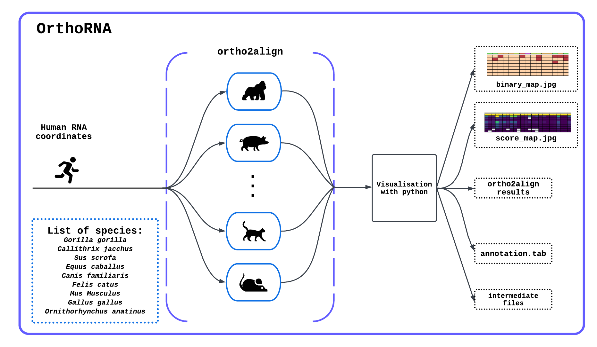

# OrthoRNA
<b>!!!This repository is currently under development.!!!</b>

```OrthoRNA``` is a Python program that searches for and analyses human RNA orthologues in 9 species:  
- Gorilla gorilla
- Callithrix jacchus
- Sus scrofa
- Equus caballus
- Canis familiaris
- Felis catus
- Mus Musculus
- Gallus gallus
- Ornithorhynchus anatinus 

The search for orthologues is performed by the <a href="https://github.com/dmitrymyl/ortho2align">ortho2align </a> tool. The process of searching for orthologues in 9 species is parallelised and the number of cores can be specified at startup.
## OrthoRNA scheme


# Usage
So far, the launch of OrthoRNA is carried out as follows:

```python3 OrthoRNA.py name_of_file_with_rna.bed number_of_cores```
