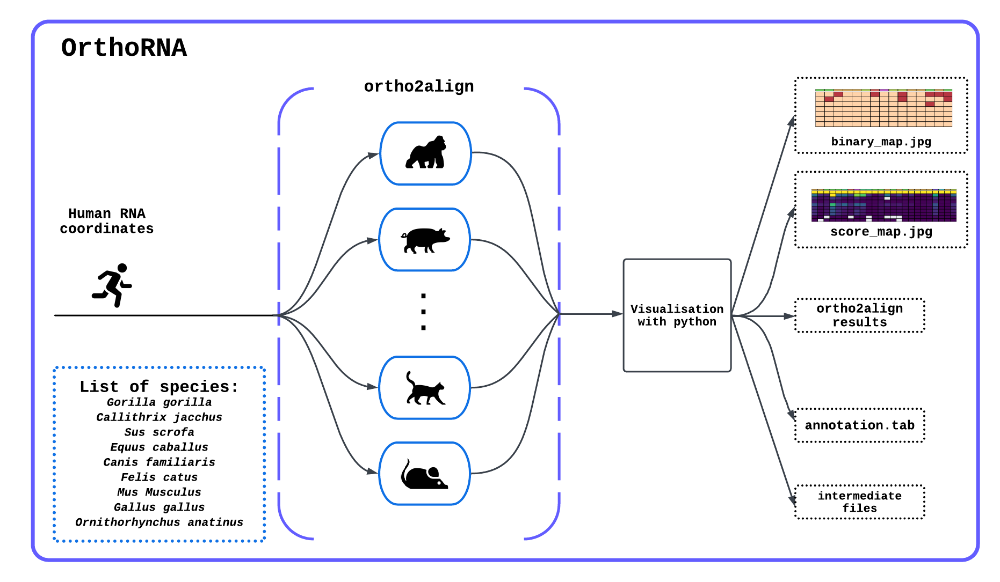

# OrthoRNA
<b>!!!This repository is currently under development.!!!</b>

```OrthoRNA``` is a Python program that searches for and analyses human RNA orthologues in 9 species:  
- Gorilla gorilla
- Callithrix jacchus
- Sus scrofa
- Equus caballus
- Canis familiaris
- Felis catus
- Mus Musculus
- Gallus gallus
- Ornithorhynchus anatinus 

The search for orthologues is performed by the <a href="https://github.com/dmitrymyl/ortho2align">ortho2align </a> tool. The process of searching for orthologues in 9 species is parallelised and the number of cores can be specified at startup.
## OrthoRNA scheme


# Usage
So far, the launch of OrthoRNA is carried out as follows:

```
usage: OrthoRNA.py [-h] bed_file_name all_cores cores_per_thread
  
positional arguments:
  bed_file_name     File path with query RNA coordinates (.bed format)
  all_cores         Total number of cores
  cores_per_thread  Number of cores per thread

optional arguments:
  -h, --help        show this help message and exit
  ```
# Output files
```
result/
├── annotation_table_of_orthologues.tab
├── binary_table_of_orthologues.tab
├── insignificant.annotation.tsv
├── score_table_of_orthologues.tab
├── score_table_of_orthologues_normalized.tab
├── cat_result/
│   ├── align_files/
│   ├── annotation_files/
│   ├── bg_files/
│   ├── build_files/
│   ├── bestSignificant.query_orthologs.bed
│   ├── bestSignificant.query_orthologs.tsv
│   ├── bestSignificant.subject_orthologs.bed
│   ├── bestSignificant.subject_orthologs.tsv
│   ├── shuffle_bg.bed
│   └── stats.txt
├── chicken_result/
└── ...
ortho2align_stderr/
├── ortho2align_stderr_cat.log
├── ortho2align_stderr_chicken.log
└── ...
```
